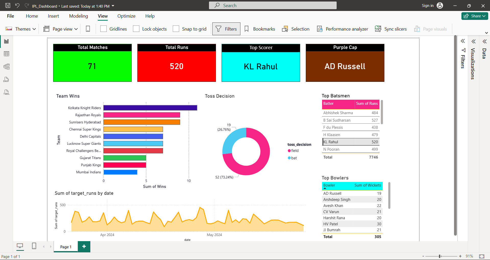
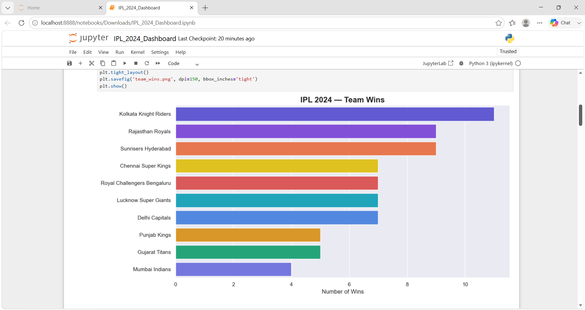
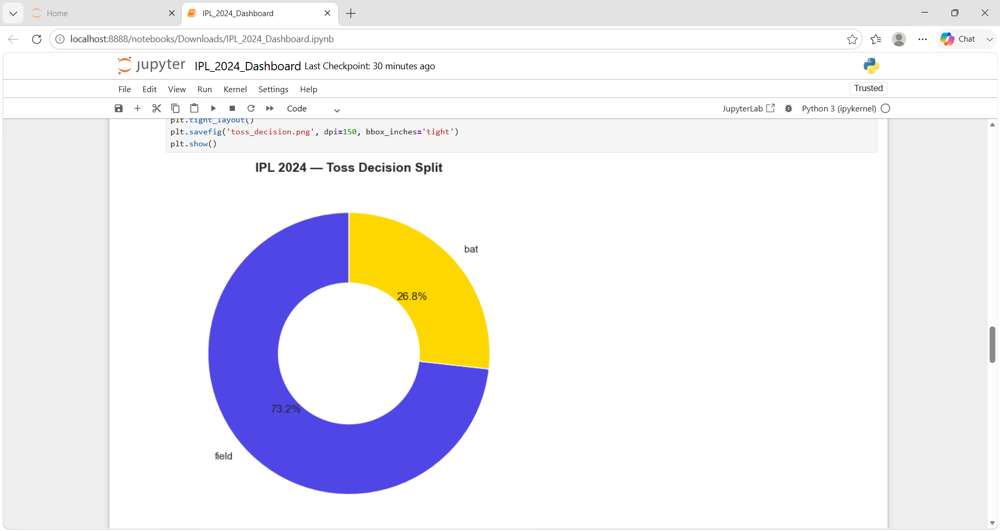

# 🏏 IPL 2024 Analytics Dashboard — Power BI

<p align="center">
  
</p>

<p align="center">
  
  
  
  
  
</p>

---

## 📌 Project Overview

This project is an end-to-end **IPL 2024 Analytics Dashboard** built using **Power BI**. The raw dataset was cleaned and preprocessed using **Python (Pandas)** in Jupyter Notebook and then exported to Excel for visualization in Power BI.

The dashboard covers all **71 matches** of IPL 2024 season with **2,60,920 ball-by-ball delivery records**, giving deep insights into team performance, player statistics, toss trends, and match results.

---

## 🏆 Key Highlights

| Metric | Value |
|--------|-------|
| 🏟️ Total Matches | 71 |
| 🏅 Orange Cap | V Kohli — 741 Runs |
| 🎯 Purple Cap | HV Patel — 30 Wickets |
| 🥇 IPL 2024 Champions | Kolkata Knight Riders — 11 Wins |
| 📦 Total Deliveries | 2,60,920 |
| 👥 Total Teams | 10 |

---

## 📊 Power BI Dashboard

> Full interactive dashboard with KPI cards, bar chart, donut chart, tables and area chart

<p align="center">
  
</p>

### Visuals Included

| Visual | Description |
|--------|-------------|
| 🃏 KPI Cards | Total Matches, Total Runs, Top Scorer, Purple Cap |
| 📊 Horizontal Bar Chart | Team-wise wins comparison across all 10 teams |
| 🍩 Donut Chart | Toss decision split — Bat vs Field |
| 📋 Top Batsmen Table | Run scorers sorted by total runs |
| 📋 Top Bowlers Table | Wicket takers sorted by total wickets |
| 📈 Area Chart | Match-wise run trend across the season |

---

## 📈 EDA Charts — Python

### 🏏 Team Wins — Bar Chart
<p align="center">
  
</p>

> KKR dominated IPL 2024 with 11 wins, followed by RR and SRH with 9 wins each.

---

### 🍩 Toss Decision Split — Donut Chart
<p align="center">
  
</p>

> 73.2% of teams chose to field first after winning the toss — showing a clear preference for chasing in IPL 2024.

---

## 🗂️ Project Structure

```
IPL-2024-Analytics-Dashboard/
│
├── 📓 IPL_2024_Dashboard.ipynb         — Jupyter Notebook (EDA + Charts + Cleaning)
├── 📊 IPL_2024_Dashboard.pbix          — Power BI Dashboard file
├── 📁 IPL_2024_Dashboard_Data.xlsx     — Cleaned dataset (7 sheets)
├── 🖼️ IPL_Dashboard.png               — Power BI Dashboard screenshot
├── 🖼️ Bar_Chart.png                   — Team Wins bar chart
├── 🖼️ Donut_Chart.png                 — Toss Decision donut chart
└── 📄 README.md                        — Project documentation
```

---

## 🔧 Tools & Technologies

| Tool | Purpose |
|------|---------|
| Power BI Desktop | Dashboard creation and visualization |
| Python 3 | Data cleaning and preprocessing |
| Pandas | Data manipulation and analysis |
| Matplotlib & Seaborn | EDA charts in Jupyter Notebook |
| Microsoft Excel | Intermediate cleaned data storage |
| Jupyter Notebook | Exploratory Data Analysis |

---

## 📂 Dataset Details

**Source:** [Kaggle — IPL Dataset](https://www.kaggle.com/datasets)

| File | Rows | Columns | Description |
|------|------|---------|-------------|
| matches.csv | 1,095 | 20 | Match-level data (2008–2024) |
| deliveries.csv | 2,60,920 | 17 | Ball-by-ball delivery data |

**Sheets in cleaned Excel file:**

| Sheet | Description |
|-------|-------------|
| Matches | All 71 IPL 2024 matches |
| Deliveries | Ball-by-ball records |
| Team_Wins | Team-wise win count |
| Top_Batsmen | Top 15 run scorers |
| Top_Bowlers | Top 15 wicket takers |
| Player_of_Match | Player of match awards |
| Venue_Stats | Stadium-wise match count |

---

## 🚀 How to Run

**Step 1 — Clone the repository**
```bash
git clone https://github.com/nakuladhave/IPL-2024-Analytics-Dashboard.git
```

**Step 2 — Install dependencies**
```bash
pip install pandas numpy matplotlib seaborn openpyxl
```

**Step 3 — Run Jupyter Notebook**
```bash
jupyter notebook IPL_2024_Dashboard.ipynb
```

**Step 4 — Open Power BI Dashboard**
- Download and open `IPL_2024_Dashboard.pbix` in Power BI Desktop
- Refresh data source if needed

---

## 👨‍💻 Author

**Nakul Adhave**
💼 Aspiring Data Analyst | AI Agent Engineer
🎓 B.Tech Graduate
📍 Dhule, Maharashtra, India

[](https://linkedin.com/in/nakul-adhave-a82294330)
[](https://github.com/nakuladhave)

---

## ⭐ If you found this project helpful, please give it a star!
